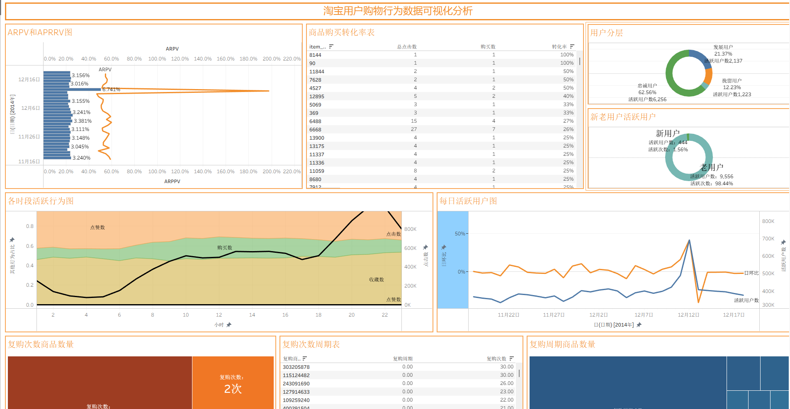

# 淘宝用户购物行为数据可视化分析

## 一、项目概述

本项目基于 Apache Spark 框架对淘宝用户购物行为数据进行深入分析，旨在挖掘用户行为模式、购买特征及复购规律，为电商运营决策提供数据支撑。项目包含数据清洗、多维度分析和可视化展示三个主要阶段。
## 可视化成果看板

---

## 二、项目目的

### 2.1 核心目标

通过对用户行为数据的分析，实现以下目标：

| 目标类别 | 具体内容 |
| :--- | :--- |
| **用户活跃度分析** | 了解用户每日、每小时的活跃规律 |
| **购买转化分析** | 分析各商品类别的购买转化率 |
| **复购行为分析** | 挖掘商品的复购周期和复购率 |
| **用户分层分析** | 对比新老用户的活跃度差异 |
| **运营决策支持** | 为促销活动、商品推荐提供数据依据 |

### 2.2 商业价值

- 优化商品推荐策略，提升用户购买转化率
- 识别高价值用户和高潜力商品类别
- 制定精准的营销活动时间和促销方案
- 降低用户流失率，提升用户忠诚度

---

## 三、技术架构

### 3.1 技术栈

| 层次 | 技术 | 说明 |
| :--- | :--- | :--- |
| **数据处理** | Apache Spark (PySpark) | 分布式数据处理框架，支持大规模数据运算 |
| **编程语言** | Python | 主要开发语言 |
| **可视化工具** | Tableau | 专业数据可视化工具 |
| **数据格式** | CSV | 数据输入和输出格式 |

### 3.2 数据流向

```
原始数据 (user_action.csv)
        ↓
    Spark读取
        ↓
   SQL分析处理
        ↓
    结果输出 (CSV)
        ↓
   Tableau可视化
        ↓
    分析报告
```

---

## 四、数据说明

### 4.1 数据来源

原始数据文件：`user_action.csv`

### 4.2 字段定义

| 字段名 | 类型 | 说明 |
| :--- | :--- | :--- |
| `user_id` | int | 用户唯一标识 |
| `item_id` | int | 商品唯一标识 |
| `behavior_type` | int | 行为类型：1-点击，2-收藏，3-加入购物车，4-购买 |
| `item_category` | int | 商品类别编号 |
| `time` | timestamp | 行为发生时间 |

### 4.3 数据时间范围

数据覆盖时间：**2014年11月18日 - 2014年12月18日**

---

## 五、分析模块

项目包含6个核心分析模块，每个模块对应一个独立的Python脚本：

### 5.1 时间维度分析 (`time_cnt_4.py`)

**分析内容**：
- 每日用户行为总数统计
- 每小时用户行为总数统计

**分析目的**：了解用户活跃的时间规律，为运营活动选择最佳时间窗口。

**关键发现**：
- 用户活跃度在12月12日达到峰值（691,712次），与"双12"促销活动高度相关
- 晚间21:00-22:00为用户活跃高峰期

### 5.2 购买转化率分析 (`buy_cnt.py`)

**分析内容**：
- 各商品类别的总行为数
- 各商品类别的购买行为数
- 各商品类别的购买转化率（按转化率降序排列）

**分析目的**：识别高转化品类和低转化品类，优化商品运营策略。

### 5.3 购买用户分析 (`buy_user_cnt.py`)

**分析内容**：
- 每日购买订单总数（behavior_type=4）
- 每日全行为活跃用户数（DAU）
- 每日购买用户数（付费DAU）

**分析目的**：监控每日购买指标变化，评估营销活动效果。

**关键发现**：
- 12月12日购买订单数达15,251单，为平时的4-5倍
- 日均活跃用户约6,500人，日均付费用户约1,500人

### 5.4 小时行为分布分析 (`hour_behavior_cnt.py`)

**分析内容**：
- 每小时各行为类型（点击/收藏/购物车/购买）的数量分布

**分析目的**：深入了解不同时段用户行为的构成差异。

**关键发现**：

| 时段 | 主要行为特征 |
| :--- | :--- |
| 00:00-06:00 | 活跃度最低，以点击为主 |
| 07:00-09:00 | 活跃度逐渐上升 |
| 10:00-17:00 | 稳定活跃期 |
| 18:00-23:00 | 活跃度高峰期，21-22点达到最高 |

### 5.5 复购周期分析 (`rebuy_cnt_cycle.py`)

**分析内容**：
- 各商品的平均复购周期（天）
- 各商品的复购次数

**分析方法**：使用Spark SQL窗口函数`LAG`计算用户对同一商品的两次购买时间间隔。

**分析目的**：识别高复购商品，制定复购激励策略。

### 5.6 用户活跃度分层分析 (`tag_activity.py`)

**分析内容**：
- 将用户分为新用户（2014年12月及之后首次行为）和老用户（2014年12月之前首次行为）
- 统计不同活跃度区间的用户数量分布

**分析目的**：了解新老用户的活跃度差异，制定差异化运营策略。

---

## 六、分析结果

### 6.1 输出文件

分析结果存储在 `处理表/` 目录下：

| 文件名称 | 对应模块 | 内容说明 |
| :--- | :--- | :--- |
| `day_cnt.csv` | time_cnt_4 | 每日行为总数 |
| `hour_cnt.csv` | time_cnt_4 | 每小时行为总数 |
| `buy_cnt_result.csv` | buy_cnt | 各品类购买转化数据 |
| `buy_user_cnt_result.csv` | buy_user_cnt | 每日购买指标 |
| `hour_behavior_cnt_result.csv` | hour_behavior_cnt | 小时行为分布 |
| `rebuy_cnt_cycle_result.csv` | rebuy_cnt_cycle | 商品复购周期 |
| `tag_activity.csv` | tag_activity | 新老用户活跃度 |

### 6.2 核心发现

1. **时间规律**：用户活跃度呈现明显的昼夜节律，晚间21:00-22:00为活跃高峰

2. **促销效应**：双12期间（12月12日）用户行为量和购买量均显著增长，购买订单数达平日4-5倍

3. **行为转化**：点击行为占比最高，购买行为占比较低，存在较大优化空间

4. **用户分层**：新老用户活跃度存在差异，需制定差异化运营策略

---

## 七、可视化展示

### 7.1 Tableau工作簿

项目包含Tableau可视化工作簿：`淘宝用户行为可视化分析.twb`

### 7.2 可视化内容

可视化报告包含以下图表类型：

| 图表类型 | 展示内容 |
| :--- | :--- |
| **趋势图** | 每日用户行为趋势 |
| **热力图** | 小时行为分布 |
| **柱状图** | 各品类购买转化率排名 |
| **折线图** | 购买指标变化趋势 |
| **散点图** | 商品复购周期分布 |

---

## 八、项目运行

### 8.1 环境要求

- Java 8+（Spark运行依赖）
- Python 3.x
- Apache Spark 3.x

### 8.2 运行方式

每个分析模块可独立运行：

```bash
# 示例：运行时间维度分析
spark-submit time_cnt_4.py
```

### 8.3 注意事项

- 脚本中数据路径需根据实际部署环境调整
- 建议使用集群模式处理大规模数据
- 结果文件输出前需确保目标目录存在且有写入权限

---

## 九、总结

本项目通过Spark大数据分析技术，对淘宝用户购物行为进行了多维度深入分析。分析结果揭示了用户活跃规律、购买转化特征和复购行为模式，为电商平台的运营决策提供了数据支撑。通过Tableau可视化展示，使分析结果更加直观易懂，便于业务人员快速获取洞察。

---

**项目版本**：1.0  
**创建日期**：2024年  
**分析周期**：2014年11月18日 - 2014年12月18日
